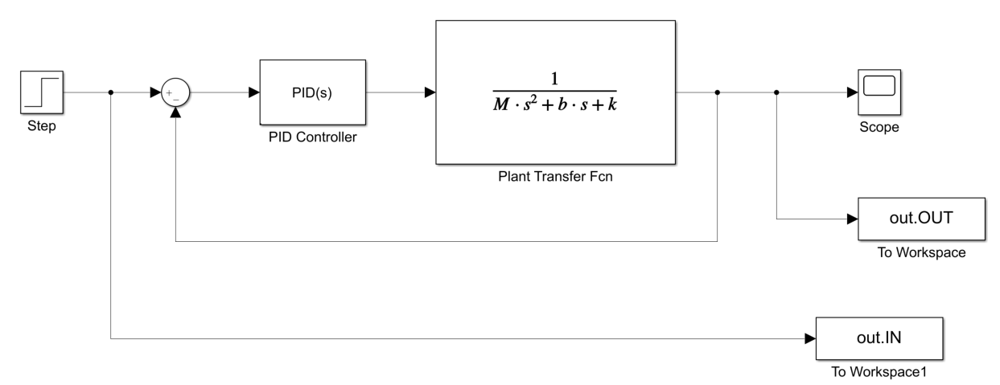
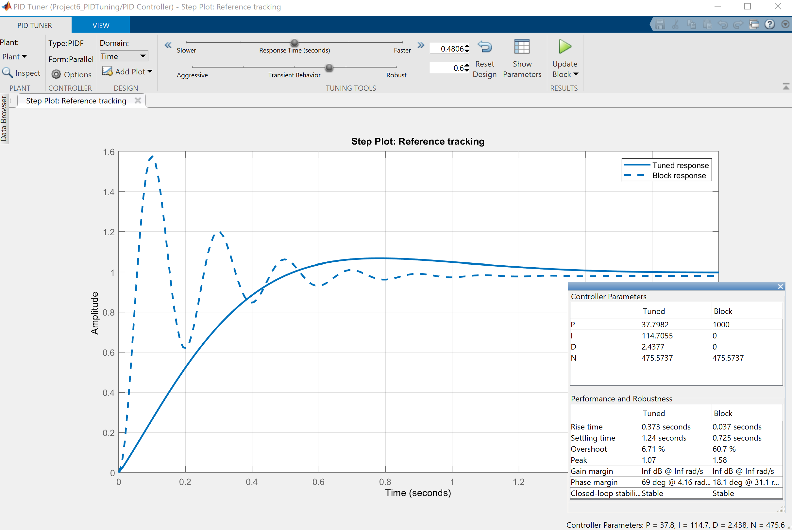
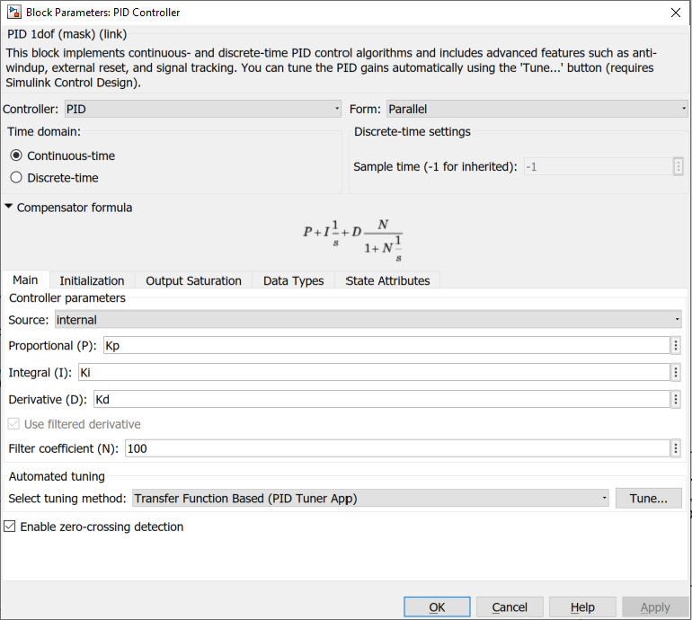

# PID Tuning with built in PID Controller Block 

> * This is a very powerful tool for any mechanical or electrical system to use. 
> * You can view all the screenshots below in the Screenshots folder. 

> &nbsp;  ### Base model for the design in Simulink.
>  

> * ### PID Control Window
> * After you implement your design and run your script from the MATLAB workspace you will be able to go into your controller and tune your controller for the desired response of the system. 
> * See the power of this below. (The dotted line is the original response.)
 
 
 > * ### Navigation
 > * To enter the view above just open up the PID Controller block and select "Tune"
 > * __Note__ This will take a short time to load, so be patient. 
 > * You can see the respective window below. 
  
