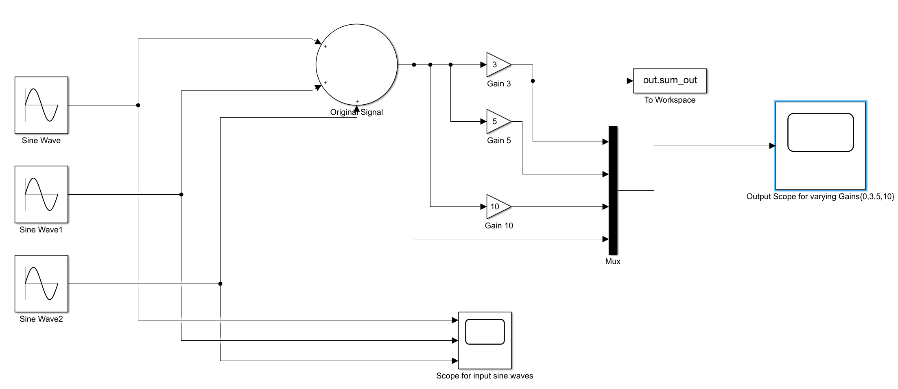

# Simulink 
### View the .slx file above to run the model 

 >There are three signals (varying frequencies and amplitudes) added together to form one signal. 
 
 >Then this signal goes through three different gains and gets outputted on onto the Outpus Scope. 
 
 >You can see that there is a block "To Workspace" that will allow the user to use raw signal data in the MATLAB workspace. 
 
  
