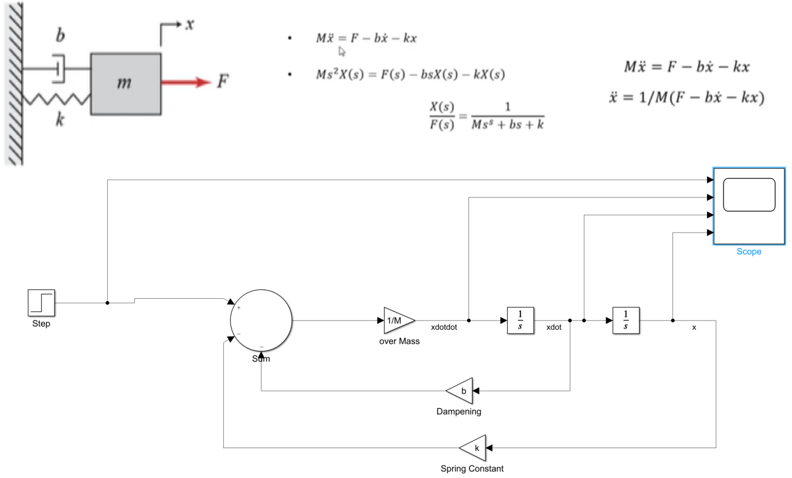
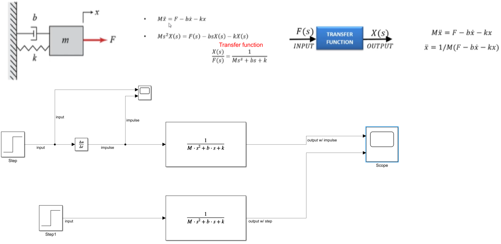

# Model and Script - Spring Mass System

### First Model
> * Here you can change the dampening and the forcing function to see different reactions. 
> * As you do this you can see overdamped, underdamped, and critical dampening with the correct respective dampening coefficents. 
> * See the circuit below

### Second Model
> * See the circuit below

